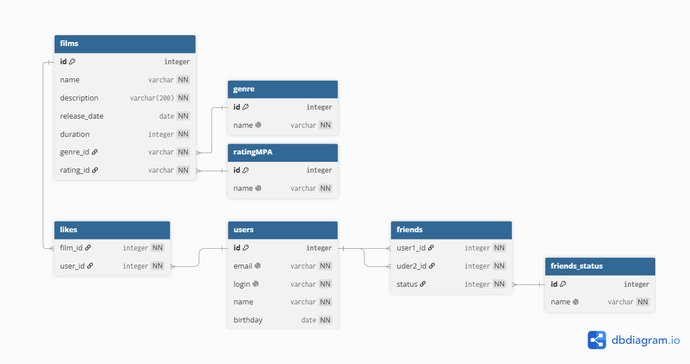

# java-filmorate

Template repository for Filmorate project.

# я никого не нашел на проверкук макета бд поэтому его никто не проверял

# Database



## Операции с базой данных

## Фильмы

### получение всех фильмов

```
SELECT f.id,
    f.name, 
    f.description,
    f.release_date, 
    f.duration, 
    COUNT(l.id) AS likes, 
    g.name, 
    r.name 
FROM films f
JOIN likes l ON f.id=l.film_id
JOIN ganre g ON f.ganre_id=g.id
JOIN ratingMPA r ON f.rating_id=r.id
GROUP BY f.id
```

### получение фильма по id

```
SELECT f.id,
    f.name, 
    f.description,
    f.release_date, 
    f.duration, 
    COUNT(l.id) AS likes, 
    g.name, 
    r.name 
FROM films f
JOIN likes l ON f.id=l.film_id
JOIN ganre g ON f.ganre_id=g.id
JOIN ratingMPA r ON f.rating_id=r.id
WHERE f.id=id
```

### получение топ популярных фильмов

```
SELECT f.id,
    f.name, 
    f.description,
    f.release_date, 
    f.duration, 
    COUNT(l.id) AS likes, 
    g.name, 
    r.name 
FROM films f
JOIN likes l ON f.id=l.film_id
JOIN ganre g ON f.ganre_id=g.id
JOIN ratingMPA r ON f.rating_id=r.id
GROUP BY f.id
ORDER BY likes DESC
LIMIT 10
```

## Пользователи

### получение всех пользователей

```
SELECT 
    u.id,
    u.email,
    u.login,
    u.name,
    u.birthday
FROM users u
```

### получение пользователя по id

```
SELECT 
    u.id,
    u.email,
    u.login,
    u.name,
    u.birthday
FROM users u
WHERE u.id=(id)
```

### получение списка друзей пользователя с id

```
SELECT 
    u.id,
    u.email,
    u.login,
    u.name,
    u.birthday
FROM users u
WHERE u.id IN(
    SELECT user2_id
    FROM users
    WHERE user1_id=(id)
    )
OR u.id IN(
    SELECT user1_id
    FROM users
    WHERE user2_id=(id)
    )
```

### получение списка общих друзей id1, id2

```
SELECT 
    u.id,
    u.email,
    u.login,
    u.name,
    u.birthday
FROM users u
WHERE
-- Получение списка id друзей 1 пользователя
(u.id IN(
    SELECT user2_id
    FROM users
    WHERE user1_id=(id1)
    )
    OR u.id IN(
    SELECT user1_id
    FROM users
    WHERE user2_id=(id1)
    )
)
AND
-- Получение списка id друзей 2 пользователя
(u.id IN(
    SELECT user2_id
    FROM users
    WHERE user1_id=(id2)
    )
    OR u.id IN(
    SELECT user1_id
    FROM users
    WHERE user2_id=(id2)
    )
)
```