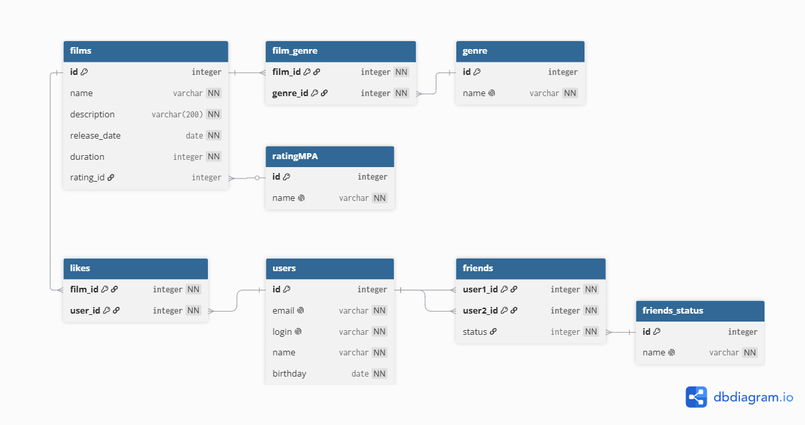

# java-filmorate

Template repository for Filmorate project.

# я никого не нашел на проверкук макета бд поэтому его никто не проверял

# Database



## Операции с базой данных

## Фильмы

### получение всех фильмов

```
SELECT f.id,
   f.name,
   f.description,
   f.release_date,
   f.duration,
   COUNT(l.user_id) AS likes,
   r.id AS rating_id
FROM films f
LEFT JOIN likes l ON f.id = l.film_id
JOIN ratingMPA r ON f.rating_id = r.id
GROUP BY f.id, f.name, f.description, f.release_date, f.duration, r.name
```

### получение фильма по id

```
SELECT f.id,
   f.name,
   f.description,
   f.release_date,
   f.duration,
   COUNT(l.user_id) AS likes,
   r.id AS rating_id
FROM films f
LEFT JOIN likes l ON f.id = l.film_id
JOIN ratingMPA r ON f.rating_id = r.id
WHERE f.id = ?
GROUP BY f.id, f.name, f.description, f.release_date, f.duration, r.name
```

### получение топ популярных фильмов

```
SELECT f.id,
   f.name,
   f.description,
   f.release_date,
   f.duration,
   COUNT(l.user_id) AS likes,
   r.id AS rating_id
FROM films f
LEFT JOIN likes l ON f.id = l.film_id
LEFT JOIN ratingMPA r ON f.rating_id = r.id
GROUP BY f.id, f.name, f.description, f.release_date, f.duration, r.name
ORDER BY COUNT(l.user_id) DESC
LIMIT ?
```

### Получение списка id жанров по id фильма

```
SELECT genre_id
FROM film_genre
WHERE film_id = ?
```

### Получение рейтинга по id

```
SELECT name FROM ratingMPA WHERE id = ?
```

## Пользователи

### получение всех пользователей

```
SELECT * FROM users
```

### получение пользователя по id

```
SELECT * FROM users WHERE id = ?
```

### получение списка друзей пользователя с id

```
SELECT * FROM users
WHERE id IN(
    SELECT user2_id
    FROM users
    WHERE user1_id=(id)
    )
```

### получение списка общих друзей id1, id2

```
SELECT * FROM users
WHERE
-- Получение списка id друзей 1 пользователя
id IN(
    SELECT user2_id
    FROM users
    WHERE user1_id = ? --id1
    )
AND
-- Получение списка id друзей 2 пользователя
id IN(
    SELECT user2_id
    FROM users
    WHERE user1_id = ? --id2
    )
```